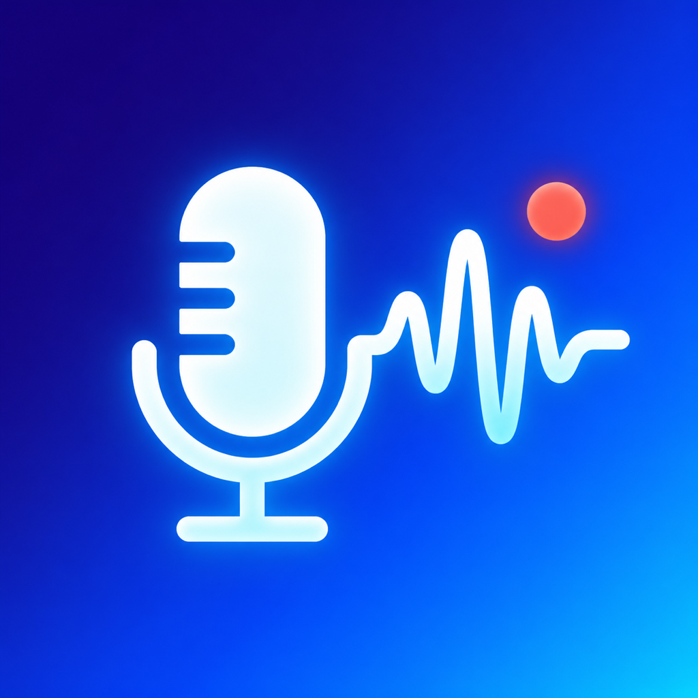

# FlowDictate

<p align="center">
  
</p>

FlowDictate is a native macOS menu bar dictation utility built with Swift, SwiftUI and AppKit. Version 4.0 adds optional on-device final transcription and restart-safe persistent processing. One dictation is recorded and processed at a time for predictable performance and insertion.

FlowDictate is an independent open-source project. It is not affiliated with or endorsed by OpenAI or Apple.

## Current features

- global start/stop and cancel shortcuts
- microphone recording with local WAV backup
- selectable audio input and live level metering
- optional local final transcription with FluidAudio and Parakeet TDT 0.6B v3 on Apple Silicon
- OpenAI transcription remains available as an explicit BYOK cloud option
- Fully offline, local-with-optional-enhancement and cloud-transcription privacy modes
- compact M4A upload preparation with file-based multipart transfer and an early size check
- clipboard-safe insertion into the application that originally had focus
- a non-activating recording and processing overlay on the display containing the mouse
- API credentials stored in macOS Keychain
- microphone and Accessibility permission guidance
- configurable clipboard restoration delay
- launch at login enabled on first installed start, with a Settings toggle to disable it
- first-run setup for storage, OpenAI credentials, permissions and hotkeys
- user-selected sandboxed recordings folder with `Documents/Recordings` as the recommended default
- persistent searchable history with audio playback and text export
- crash recovery and orphaned-recording detection
- manual retry plus bounded automatic retry for temporary provider failures
- automatic long-recording segmentation with ordered partial transcripts, per-segment progress, retry and restart-safe continuation
- a persistent job manifest for safe restart recovery and deferred insertion when the original target is unavailable
- provider selection globally and per app profile; provider, model, language and insertion target are frozen for each job
- deterministic German and English in-dictation correction commands before formatting and dictionary processing
- configurable Restore Last Dictation hotkey
- separate, configurable retention for successful audio and visible history while failed recordings remain protected
- optional on-device Apple Speech Live Preview while recording
- compact, standard and expanded non-activating overlays with configurable placement
- an explicit five-second Preview test that never calls OpenAI or writes to History
- deterministic spoken formatting commands for German and English
- a local personal dictionary with language, case and whole-word rules
- built-in and custom writing styles with optional OpenAI text enhancement
- separate Original, Formatted, Dictionary and Final stages in History
- enhancement retry, reprocessing and safe local/original fallbacks without retranscribing audio
- versioned dictionary and writing-style JSON import/export
- a dedicated macOS app icon for Finder, Accessibility settings and installed builds
- selectable microphone or digital System Audio recording, with separate permission guidance and a local five-second source test
- recording-source metadata in the overlay and History; microphone remains the migration-safe default
- app-specific profiles selected by bundle identifier for language, transcription model, writing style, spoken formatting and insertion preference
- automatic direct Accessibility insertion with a bounded clipboard fallback; Microsoft Word uses its reliable clipboard path immediately, `Clipboard only` remains available per app and protected password fields are never written
- selectable toggle or press-and-hold shortcut activation
- optional local usage statistics calculated from History, with Total, 30-day and 14-day views plus a non-destructive reset
- a daily, disableable GitHub release check that only opens the release page and never installs automatically

The optional combined microphone-plus-system-audio mixer, bulk export and profile import/export remain follow-up scope. Cloud audio streaming is not used.

Long or oversized recordings are prepared as local M4A segments and transcribed sequentially. Successful segments are persisted before the next upload, so a pause, temporary failure or app restart continues at the first unfinished segment.

## Requirements

- Xcode 26.6 or a compatible Xcode version
- macOS 14 or later
- Apple Silicon for local final transcription, or an OpenAI API key on Apple Silicon and Intel Macs
- approximately 750 MB of additional storage for the optional local model

## Configure and run

1. Open `FlowDictate.xcodeproj` and run the `FlowDictate` scheme.
2. Follow the first-run setup assistant.
3. Confirm `Documents/Recordings` or choose another recordings folder.
4. Choose local transcription and download the model, or enter the owner's OpenAI API key; the key is stored in macOS Keychain.
5. Grant Microphone and Accessibility permissions. Speech Recognition is optional and only needed for microphone Live Preview. Screen & System Audio Recording permission is requested only if System Audio is selected or tested.
6. Place the cursor in another application and press Option + Space.
7. Speak, then press Option + Space again to transcribe and insert the text.

Option + Shift + Space cancels a recording without sending it for transcription. The recording remains local so cancellation never destroys captured audio.

During development only, `OPENAI_API_KEY` and `FLOWDICTATE_TRANSCRIPTION_MODEL` may be supplied through a local, unshared Xcode scheme. Never put credentials in **Arguments Passed On Launch**, source code, `.env.example`, or a shared scheme.

## Settings

- **General:** launch at login and permission status
- **Dictation:** shortcuts, toggle/press-and-hold activation, Live Preview, overlay size, position, text limit and Preview test
- **Audio:** microphone/System Audio source, permissions, five-second source test, input device and live level
- **Transcription:** privacy mode, local/OpenAI provider, local model management, optional Keychain credential and language
- **Smart Dictation:** spoken formatting, personal dictionary, writing styles, optional enhancement model and fallback behavior
- **Storage:** recordings folder, retention and Phase 1 migration
- **App Profiles:** per-app language, model, style, formatting and insertion overrides
- **Productivity:** local usage statistics and Community update notices
- **Advanced:** clipboard restoration delay and automatic retries

If a selected microphone disappears, FlowDictate falls back to the current system input device. Recordings are stored before upload in the folder selected during setup. History metadata remains local in the app's Application Support container.

New installations keep at most 1,000 visible history entries and 365 days by default. Existing installations remain unlimited until the user chooses limits. A history entry whose audio must still be retained is archived instead of being treated as an orphan; its compact archive marker is removed after the separate audio-retention rule removes the file.

## Standalone release

For a free build intended for personal use and a trusted circle, run:

```sh
./scripts/build-community-release.sh
```

It creates an ad hoc signed universal ZIP for Apple Silicon and Intel Macs. No paid Apple Developer membership is required. Because the build is not notarized, recipients must approve its first launch manually as described in `COMMUNITY_INSTALLATION.md` (German) or `COMMUNITY_INSTALLATION_EN.md` (English).

For version 4.0.2 the generated files are:

- `FlowDictate-4.0.2-Community-macOS.zip`
- `FlowDictate-4.0.2-Community-macOS.zip.sha256`

`scripts/build-release.sh` remains available for a future Developer ID signed and notarized release. Both workflows are documented in `RELEASE.md`.

Prebuilt Community editions are published separately under [GitHub Releases](https://github.com/Hank1210/FlowDictate/releases). Release archives are not committed to the source repository.

See [CHANGELOG.md](CHANGELOG.md) for version history. Phase 4.0 implementation and release gates are described in [FlowDictate_PRD_Phase_4_0.md](FlowDictate_PRD_Phase_4_0.md).

## Updating from 2.0

Quit FlowDictate, replace the existing app in `Applications`, and open the new app once using right-click → Open. Settings, the selected recordings folder and the Keychain credential remain local. History is migrated to the Phase 3.2 schema on first use; FlowDictate creates a one-time `dictations-pre-3.2.json` backup before writing the migrated file. macOS may request Accessibility, Microphone, Speech Recognition or Keychain approval again because Community builds use an ad hoc signature.

## Privacy

FlowDictate contains no analytics, advertising or developer-operated backend. With local transcription, microphone and System Audio recordings never leave the Mac. With OpenAI selected, audio is sent directly to OpenAI only when a dictation is submitted. Optional AI writing styles can separately send locally processed text when the selected privacy mode permits it. See [PRIVACY.md](PRIVACY.md) and [THIRD_PARTY_NOTICES.md](THIRD_PARTY_NOTICES.md) for details.

Live Preview uses Apple's on-device speech recognizer only. Its provisional text stays in memory and is never stored, logged, inserted into another app or used as the final transcript.

## License

FlowDictate is available under the [MIT License](LICENSE). You may use, modify and redistribute it subject to that license.

## Build from the command line

```sh
DEVELOPER_DIR=/Applications/Xcode.app/Contents/Developer \
xcodebuild clean build \
  -project FlowDictate.xcodeproj \
  -scheme FlowDictate \
  -configuration Debug \
  -destination 'platform=macOS,arch=arm64'
```

## Tests

```sh
DEVELOPER_DIR=/Applications/Xcode.app/Contents/Developer \
xcodebuild test \
  -project FlowDictate.xcodeproj \
  -scheme FlowDictate \
  -destination 'platform=macOS,arch=arm64'
```

The scheme's Test action uses the dedicated `DebugTests` configuration and the bundle identifier `de.euler.FlowDictate.TestHost`. This prevents XCTest builds in temporary DerivedData folders from invalidating the Accessibility permission of the normal `de.euler.FlowDictate` app. Do not override the test command with `-configuration Debug`.

The automated tests cover configuration, compact upload preparation, multipart construction, upload-size protection, long-form planning/export/merge/session recovery, state rules, start/stop/cancel orchestration, shared retry execution, history persistence and migration (including audio-source defaults), retention and recovery, bounded Preview buffering, spoken formatting, Smart Dictation, app-profile persistence, statistics and release comparison. Microphone and System Audio permissions, Speech Recognition, Accessibility, folder authorization, overlay placement, live OpenAI responses and insertion into third-party applications require manual macOS testing.

The `FlowDictateUITests` target contains an optional menu bar launch test. It is skipped by the shared scheme because macOS requires separate UI-automation approval for the XCTest runner. After granting that permission, run it explicitly with `-only-testing:FlowDictateUITests`.

## Manual verification

Test short, long, German, English and mixed-language dictation in Notes, Safari, Chrome, Mail, VS Code and Word or an equivalent editor. Also verify:

- rapid shortcut presses do not create overlapping recordings
- cancel does not call the transcription provider
- the overlay appears on the display containing the mouse and never steals focus
- microphone switching and default-device fallback
- text and non-text clipboard restoration
- invalid key and offline errors retain the audio file
- interrupted transcription is recoverable from History
- `Documents/Recordings` access survives an app restart
- Restore Last Dictation inserts at the current cursor
- launch at login works from an installed, consistently signed build; if macOS requires approval, follow the link to Login Items shown in Settings
- Live Preview works for German and English and is clearly marked as provisional
- denying Speech Recognition or using an unsupported locale does not interrupt recording or final transcription
- disabling Live Preview causes no Speech prompt and leaves normal dictation unchanged
- Compact, Standard and Expanded remain non-activating at every supported position
- the five-second Preview test deletes its temporary recording and creates no History entry
- Original style performs only local processing and makes no enhancement request
- German and English formatting commands, literal escape and URL preservation
- dictionary word boundaries, capitalization, language filters and overlapping rules
- every writing style, custom style creation and dictionary/style import/export
- failed enhancement retains every text stage and supports Retry, Local and Original recovery
- numbers, URLs and dictionary terms remain intact after AI enhancement
- System Audio permission denial leaves microphone dictation usable
- the five-second System Audio test creates no History entry, makes no OpenAI request and removes its temporary file
- System Audio captures another app's playback without storing video and produces a transcribable M4A
- two app profiles apply different settings by bundle identifier and remain frozen for each recording
- direct insertion works where supported, falls back safely, and never writes into password fields
- toggle and press-and-hold both produce exactly one recording per gesture
- local statistics match History and disappear when disabled
- release checks ignore equal, older, draft and prerelease versions and never install anything
