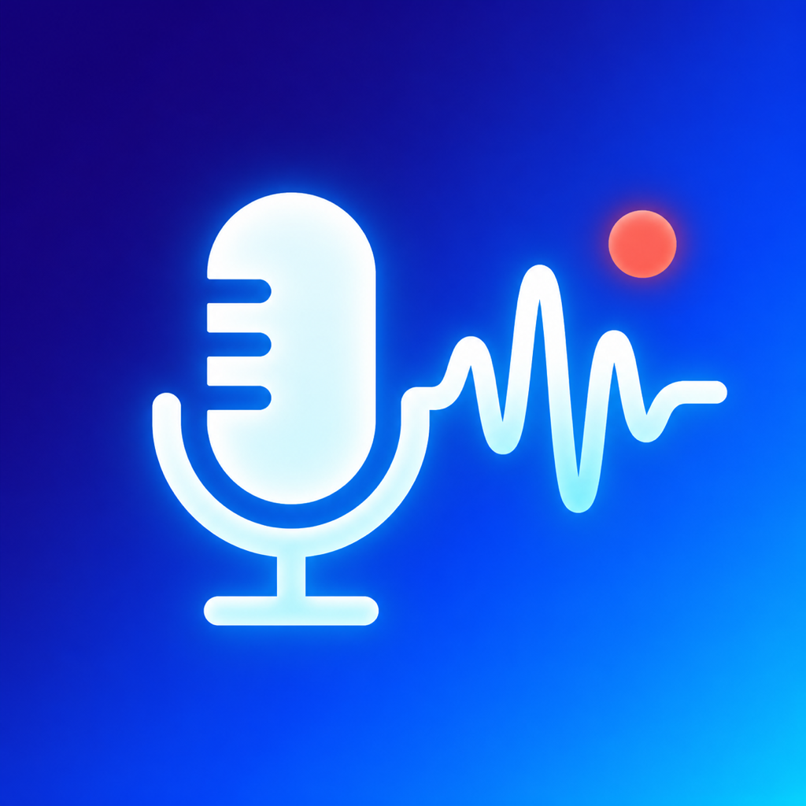

# FlowDictate

<p align="center">
  
</p>

FlowDictate is a native macOS menu bar dictation utility built with Swift, SwiftUI and AppKit. Version 4.1 adds opt-in microphone-plus-system-audio recording with separate original tracks, a role-labelled transcript and restart-safe processing. One dictation or meeting is recorded and processed at a time.

FlowDictate is an independent open-source project. It is not affiliated with or endorsed by OpenAI or Apple.

## Current features

- Global shortcuts for microphone dictation, with safe insertion into the app that had focus.
- Local transcription on Apple Silicon or explicit OpenAI BYOK transcription.
- Optional live preview, spoken formatting, personal dictionary, writing styles and per-app profiles.
- Opt-in microphone-plus-System-Audio meetings with separate original tracks and a role-labelled transcript.
- Searchable History, configurable retention, archiving, export and restart-safe recovery.
- Source and permission tests, recording quality warnings and a non-activating overlay.

The full [feature and settings reference](docs/FEATURES.md) describes behavior and limits. Mixed recording does not create a combined original audio file or identify individual remote speakers: `You` means the microphone track and `System Audio` means the captured output. Bulk export and profile import/export remain follow-up scope. Cloud audio streaming is not used.

Known 4.1 limitation: in the real 30-, 60- and 120-minute meeting tests, short gaps occurred on the System Audio track (65 ms, 33 ms and 422 ms total respectively; the longest single gap was 137 ms). A gap can omit part of a word. The app keeps both originals, reports capture quality and supports recovery; it does not claim lossless capture on every Mac or audio route.

Long or oversized recordings are prepared as local M4A segments and transcribed sequentially. Successful segments are persisted before the next upload, so a pause, temporary failure or app restart continues at the first unfinished segment.

## Requirements

- Xcode 26.6 or a compatible Xcode version
- macOS 14 or later
- Apple Silicon for local final transcription, or an OpenAI API key on Apple Silicon and Intel Macs
- approximately 750 MB of additional storage for the optional local model
- for mixed meetings, about 1.4 GB per hour for two uncompressed original tracks at 48 kHz; aligned working copies and transcription artifacts need additional space

## Configure and run

1. Open `FlowDictate.xcodeproj` and run the `FlowDictate` scheme.
2. Follow the first-run setup assistant.
3. Confirm `Documents/Recordings` or choose another recordings folder.
4. Choose local transcription and download the model, or enter the owner's OpenAI API key; the key is stored in macOS Keychain.
5. Grant Microphone and Accessibility permissions. Speech Recognition is optional and only needed for microphone Live Preview; macOS Dictation must also be enabled for that Preview. Standalone System Audio uses Screen & System Audio Recording; mixed meetings use System Audio Recording Only on macOS 14.2+ and the ScreenCaptureKit permission on macOS 14.0/14.1.
6. Place the cursor in another application and press Option + Space.
7. Speak, then press Option + Space again to transcribe and insert the text.

Option + Shift + Space cancels a recording without sending it for transcription. The recording remains local so cancellation never destroys captured audio.

During development only, `OPENAI_API_KEY` and `FLOWDICTATE_TRANSCRIPTION_MODEL` may be supplied through a local, unshared Xcode scheme. Never put credentials in **Arguments Passed On Launch**, source code, `.env.example`, or a shared scheme.

## Settings

Settings cover shortcuts, recording sources, transcription, Smart Dictation, storage, app profiles and privacy. See the [feature and settings reference](docs/FEATURES.md) for the full list.

If a selected microphone disappears, FlowDictate falls back to the current system input device. Recordings are stored before upload in the folder selected during setup. Mixed sessions keep their two originals and derived/transcription files in a `MeetingSessions` subfolder there. History metadata remains local in the app's Application Support container.

New installations keep at most 1,000 visible history entries and 365 days by default. Existing installations remain unlimited until the user chooses limits. A history entry whose audio must still be retained is archived instead of being treated as an orphan; its compact archive marker is removed after the separate audio-retention rule removes the file.

## Standalone release

For a free build intended for personal use and a trusted circle, run:

```sh
./scripts/build-community-release.sh
```

It creates an ad hoc signed universal ZIP for Apple Silicon and Intel Macs. No paid Apple Developer membership is required. Because the build is not notarized, recipients must approve its first launch manually as described in `COMMUNITY_INSTALLATION.md` (German) or `COMMUNITY_INSTALLATION_EN.md` (English).

For version 4.1.0 the generated files are:

- `FlowDictate-4.1.0-Community-macOS.zip`
- `FlowDictate-4.1.0-Community-macOS.zip.sha256`

`scripts/build-release.sh` remains available for a future Developer ID signed and notarized release. Both workflows are documented in `RELEASE.md`.

Prebuilt Community editions are published separately under [GitHub Releases](https://github.com/Hank1210/FlowDictate/releases). Release archives are not committed to the source repository.

See [CHANGELOG.md](CHANGELOG.md) for version history and the [documentation index](docs/README.md) for requirements, engineering notes and release notes.

The 4.1.0 release description is prepared in [RELEASE_NOTES_4.1.0.md](docs/releases/RELEASE_NOTES_4.1.0.md). It is kept separate from the tested ZIP so documentation-only preparation does not change that archive.

## Updating an existing installation

Quit FlowDictate, replace the existing app in `Applications`, and open the new app once using right-click → Open. Settings, the selected recordings folder and the Keychain credential remain local. Before the first schema-7 History write, FlowDictate creates a one-time `dictations-pre-4.1.json` backup. Existing single-track entries remain single-track. macOS may request Accessibility, Microphone, System Audio, Speech Recognition or Keychain approval again because Community builds use an ad hoc signature.

## Privacy

FlowDictate contains no analytics, advertising or developer-operated backend. With local transcription, microphone and System Audio recordings never leave the Mac. With OpenAI selected, audio is sent directly to OpenAI only when a dictation is submitted. Optional AI writing styles can separately send locally processed text when the selected privacy mode permits it. See [PRIVACY.md](PRIVACY.md) and [THIRD_PARTY_NOTICES.md](THIRD_PARTY_NOTICES.md) for details.

Live Preview uses Apple's on-device speech recognizer only. Its provisional text stays in memory and is never stored, logged, inserted into another app or used as the final transcript.

## License

FlowDictate is available under the [MIT License](LICENSE). You may use, modify and redistribute it subject to that license.

## Build from the command line

```sh
DEVELOPER_DIR=/Applications/Xcode.app/Contents/Developer \
xcodebuild clean build \
  -project FlowDictate.xcodeproj \
  -scheme FlowDictate \
  -configuration Debug \
  -destination 'platform=macOS,arch=arm64'
```

## Tests

```sh
DEVELOPER_DIR=/Applications/Xcode.app/Contents/Developer \
xcodebuild test \
  -project FlowDictate.xcodeproj \
  -scheme FlowDictate \
  -destination 'platform=macOS,arch=arm64'
```

The scheme's Test action uses the dedicated `DebugTests` configuration and the bundle identifier `de.euler.FlowDictate.TestHost`. This prevents XCTest builds in temporary DerivedData folders from invalidating the Accessibility permission of the normal `de.euler.FlowDictate` app. Do not override the test command with `-configuration Debug`.

The automated tests cover configuration, compact upload preparation, multipart construction, upload-size protection, long-form planning/export/merge/session recovery, state rules, start/stop/cancel orchestration, shared retry execution, history persistence and migration (including audio-source defaults), retention and recovery, bounded Preview buffering, spoken formatting, Smart Dictation, app-profile persistence, statistics and release comparison. Microphone and System Audio permissions, Speech Recognition, Accessibility, folder authorization, overlay placement, live OpenAI responses and insertion into third-party applications require manual macOS testing.

The `FlowDictateUITests` target contains an optional menu bar launch test. It is skipped by the shared scheme because macOS requires separate UI-automation approval for the XCTest runner. After granting that permission, run it explicitly with `-only-testing:FlowDictateUITests`.

## Manual verification

Use the [manual verification checklist](docs/MANUAL_VERIFICATION.md) for cross-app, permission, recording, recovery and release checks. Automated tests do not replace these macOS checks.
